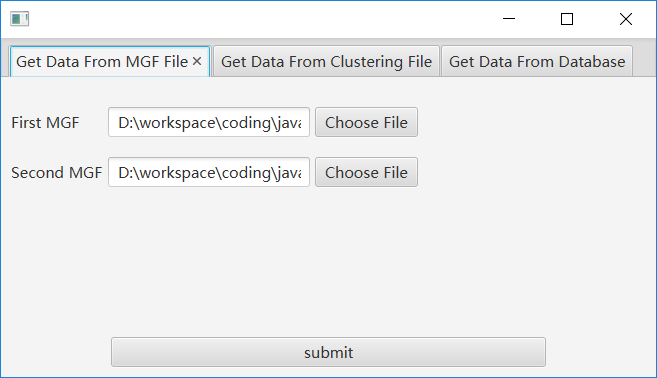
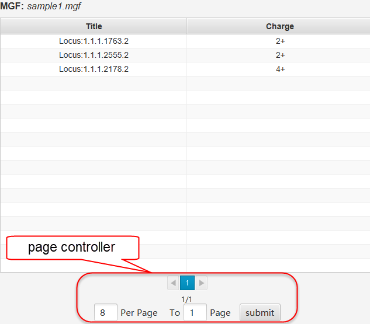
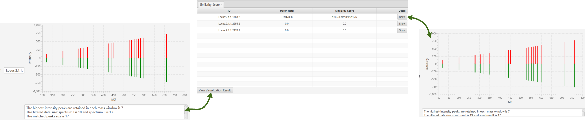
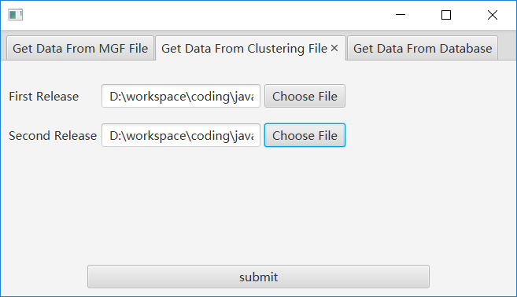
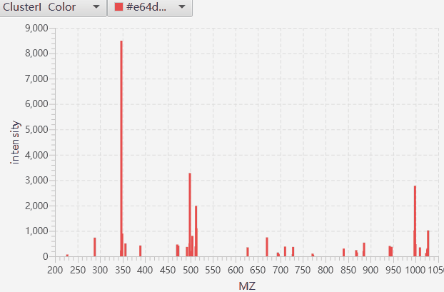
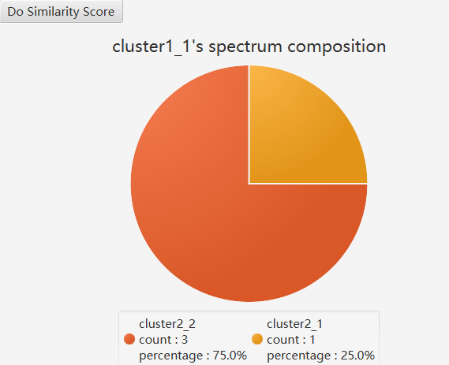
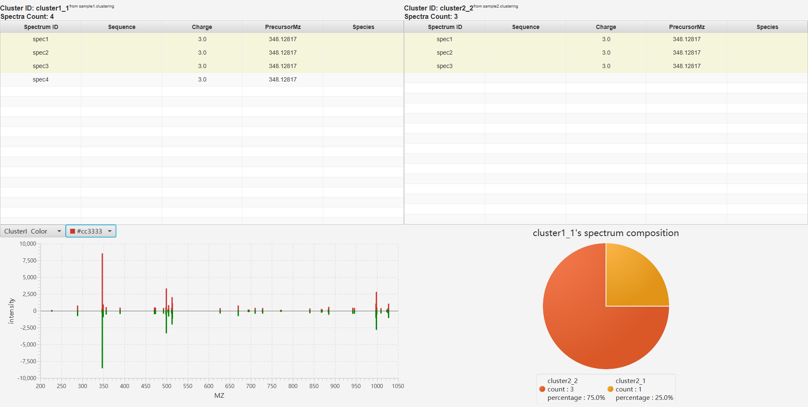
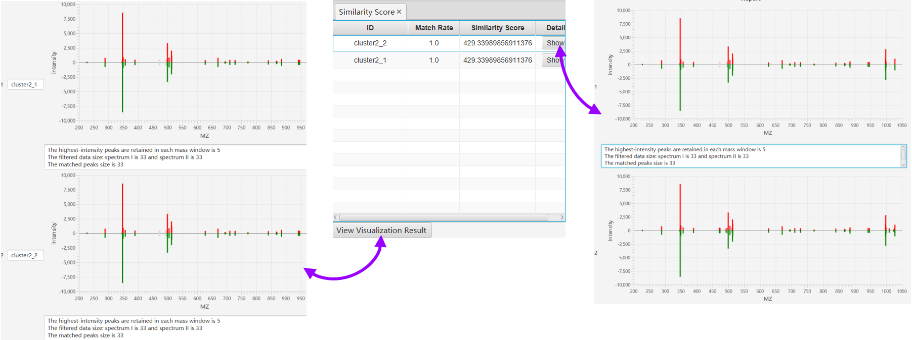

# 简介
**Cluster Comparer GUI**是一款专注于蛋白质组学质谱数据分析的软件，其主要功能有：
1. 对谱图进行相似性打分（目前支持的文件格式包含MGF文件格式和`*.clustering`文件格式）
2. 对谱图聚类结果进行可视化和分析（目前支持`*.clustering`文件格式）

> 相似性算法采用了[A Pipeline for Differential Proteomics in Unsequenced Species](https://pubs.acs.org/doi/abs/10.1021/acs.jproteome.6b00140)一文中的计算方式

> `*.clustering`文件格式用于存储MS/MS谱图聚类的结果，关于`*.clustering`文件格式详细介绍可以参考[https://github.com/spectra-cluster/clustering-file-reader](https://github.com/spectra-cluster/clustering-file-reader)

# MGF文件的分析和可视化

## 1. 读取数据

菜单栏中以此点选`File`->`Import Data`，在弹窗中选择`Get Data From MGF File`，然后选择需要进行分析的MGF文件，因为想要进行相似性打分，所以需要输入两个文件。



## 2. 查看结果

### MGF table

**MGF table**显示MGF文件的内容



支持操作：
- 点击表格不同的谱图，**Similarity Score Table**、**Peak Map**会随之变化

## Similarity Score table

**Similarity Score table**显示当前谱图与另外一个文件中所有的谱图比对，进行相似性打分的结果。



- ID：同**MGF table**的Title

- Match Rate：在考虑容错率的条件下，两个谱图匹配的峰比例（匹配的峰 / 两处理后的谱图峰数目的最大值）

- Similarity Score：相似性得分，**相似性得分越高越相似**。

- Detail：点击**Show**按钮显示每次迭代结果的报告

    - 筛选掉的数据具有一定的透明度，实际用于计算的数据不透明

- 点击**View Visualization Result**按钮将会给出比对的可视化结果——最优相似性分数对应的数据处理结果


# `*.clustering`文件的分析和可视化

## 1. 读取数据

菜单栏中以此点选`File`->`Import Data`，在弹窗中选择`Get Data From Clustering File`，然后选择需要进行分析的`*.clustering`文件。



## 2. 查看结果

在提交待分析的文件后，软件会给出分析报告。

### cluster table和spectrum table

**cluster table**和**spectrum table**显示了`*.clustering`的内容


支持操作：
- 点击**switch**按钮显示另一个`*.clustering`的内容
- 单击**cluster table**中不同的cluster时，**spectrum table**、**peak map**、**pie chart**、**network graph**会相应改变
- 通过**page controller**改变每页显示结果的数目，也可以跳转到你指定的页码

### peak map

**peak map**显示了**cluster table**中指定cluster的所有峰



支持操作：
- 通过颜色选择器调节颜色
- 放大显示鼠标左键选择范围内的峰

### pie chart

**pie chart**显示了**cluster table**中指定cluster中包含的谱图在另一个`.clustering`文件中的分布情况。



举个例子来说明饼图的含义：

- File I: sample1.clustering

```
=Cluster=
id=cluster1_1
av_precursor_mz=348.128
av_precursor_intens=1.0
consensus_mz=227.292,288.314,...
consensus_intens=29.8,693.84,191.04,...
SPEC	spec1			348.12817	3.0			0.0
SPEC	spec2			348.12817	3.0			0.0
SPEC	spec3			348.12817	3.0			0.0
SPEC	spec4			348.12817	3.0			0.0

=Cluster=
id=cluster1_2
av_precursor_mz=348.128
av_precursor_intens=1.0
consensus_mz=227.292,288.314,...
consensus_intens=29.8,693.84,...
SPEC	spec5			348.12817	3.0			0.0
SPEC	spec7			348.12817	3.0			0.0
SPEC	spec8			348.12817	3.0			0.0
SPEC	spec9			348.12817	3.0			0.0
SPEC	spec10			348.12817	3.0			0.0
```

- File II: sample2.Clustering

```
=Cluster=
id=cluster2_1
av_precursor_mz=348.128
av_precursor_intens=1.0
consensus_mz=227.292,288.314,...
consensus_intens=29.8,693.84,...
SPEC	spec4			348.12817	3.0			0.0
SPEC	spec5			348.12817	3.0			0.0
SPEC	spec6			348.12817	3.0			0.0
SPEC	spec7			348.12817	3.0			0.0
SPEC	spec8			348.12817	3.0			0.0
SPEC	spec9			348.12817	3.0			0.0

=Cluster=
id=cluster2_2
av_precursor_mz=348.128
av_precursor_intens=1.0
consensus_mz=227.292,288.314,...
consensus_intens=29.8,693.84,...
SPEC	spec1			348.12817	3.0			0.0
SPEC	spec2			348.12817	3.0			0.0
SPEC	spec3			348.12817	3.0			0.0

=Cluster=
id=cluster2_3
av_precursor_mz=348.128
av_precursor_intens=1.0
consensus_mz=227.292,288.314,...
consensus_intens=29.8,693.84,191.04,...
SPEC	spec10			348.12817	3.0			0.0
SPEC	spec11			348.12817	3.0			0.0
```
在`sample1.clustering`中的cluster1_1中包含谱图{spec1, spec2, spec3, spec4}，这些谱图在`sample2.clustering`中分散在cluster2_1{spec4}和cluster2_2{spec1, spec2, spec3}中，这就形成了上面的饼图。

支持操作：
- 单击饼图的分块，将显示两个cluster的比较

  - 两个cluster重叠的spectrum会高亮显示
  - **peak map**显示了两个cluster峰的对比情况，可以使用之前介绍的操作调节它的显示



- Do Similarity Score

  单击**Do Similarity Score**按钮会针对当前cluster和饼图显示的cluster进行相似性打分（上面的例子应该是针对cluster1_1 vs cluster2_1和cluster2_2进行相似性打分）。

  - ID：同**cluster table**ID
  - Match Rate：在考虑容错率的条件下，两个谱图匹配的峰比例（匹配的峰 / 两处理后的谱图峰数目的最大值）
  - Similarity Score：相似性得分，**相似性得分越高越相似**。
  - Detail：点击**Show**按钮显示每次迭代结果的报告

    - 筛选掉的数据具有一定的透明度，实际用于计算的数据不透明

  - 点击**View Visualization Result**按钮将会给出比对的可视化结果——最优相似性分数对应的数据处理结果



### network graph

以**cluster table**中指定的cluster为起点，搜索其相关的spectrum的分布，根据搜索结果的内在联系做出**network graph**


举一个例子说明**network graph**的含义（依旧使用上面给出的sample1.clustering和sample2.clustering）：


cluster1_1中的谱图分散在cluster2_1和clustering2_2中，但是cluster2_1中还包含了不在cluster1_1中的谱图{spec5, spec7, spec8, spec9}这部分谱图被聚到了cluster1_2中，而cluster1_2中的spec10实在cluster2_3中，在**network graph**中为了表示这种关系，使用节点存储cluster，使用边连接存在重叠谱图的节点，节点的纵向宽度代表了该类簇包含的谱图数量，边的纵向宽度代表了两类簇共同拥有的谱图的数量。

支持操作：
- 点击节点，显示cluster信息
- 点击边，显示两个cluster的比对情况
